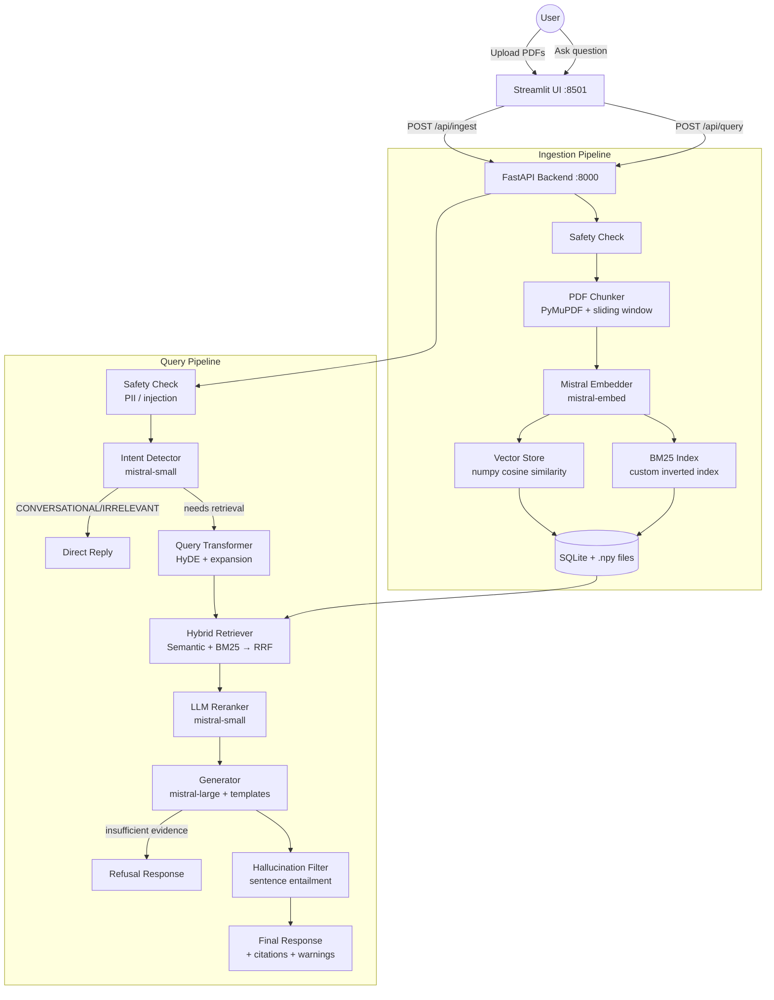
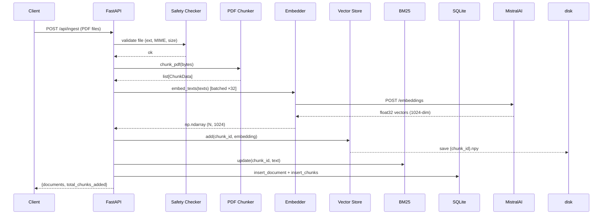
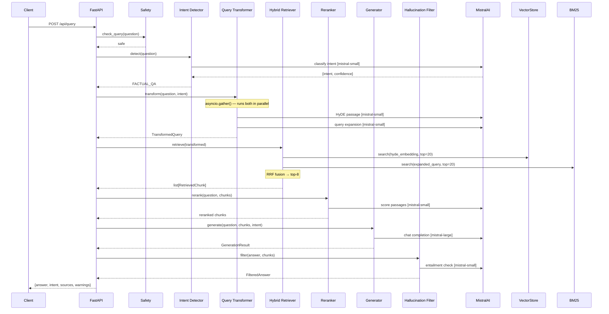

# RAG Pipeline

A production-quality Retrieval-Augmented Generation (RAG) system built from scratch in Python. Upload PDF documents, ask questions, and receive grounded answers with citations — powered by the Mistral AI API.

> **No external RAG or search frameworks are used.** Vector search, BM25, and hybrid retrieval are all implemented from scratch.

---

## Table of Contents

1. [System Design](#system-design)
2. [Architecture](#architecture)
3. [Data Flow](#data-flow)
4. [Component Deep-Dives](#component-deep-dives)
5. [Bonus Features](#bonus-features)
6. [Setup & Running](#setup--running)
7. [API Reference](#api-reference)
8. [Libraries Used](#libraries-used)

---

## System Design

The pipeline is split into two services:

| Service | Technology | Port |
|---|---|---|
| Backend API | FastAPI + Python 3.11 | 8000 |
| Chat UI | Streamlit | 8501 |

At startup the backend loads all persisted embeddings into a numpy matrix and rebuilds the BM25 index from SQLite. Both are kept in memory for fast query-time lookup.

**Storage:**
- `data/rag.db` — SQLite for document and chunk metadata
- `data/embeddings/{chunk_id}.npy` — one numpy file per chunk embedding
- `data/bm25_index.json` — serialised BM25 inverted index (saved on shutdown)

---

## Architecture



---

## Data Flow

### Ingestion



### Query



---

## Component Deep-Dives

### PDF Chunker (`app/core/chunker.py`)

**Algorithm: semantic-boundary-aware sliding window**

1. Extract text blocks per page using `page.get_text("blocks")` — preserves reading order better than plain `page.get_text()`.
2. Detect and specially handle **table-like blocks** (tab / wide-space alignment) → emitted as atomic chunks with a `[TABLE]` prefix.
3. Detect **section headings** (`r"^(\d+(\.\d+)*\.?\s|#{1,4}\s)"`) → prepended to the following paragraph to preserve section context.
4. **Greedy merge**: accumulate paragraphs until the token budget is approached.
5. **Overflow → emit + carry-over**: when the next paragraph would exceed the budget, emit the current chunk, carry forward the last `overlap_chars` as context for the next chunk.

**Parameters:**
- `chunk_size_tokens = 512` → `~2 048 characters` (1 token ≈ 4 chars)
- `chunk_overlap_tokens = 64` → `~256 characters` (12.5% overlap)

#### Chunking Considerations

**Why 512 tokens?**

`mistral-embed` accepts up to 8 192 tokens ([Pinecone model card](https://docs.pinecone.io/models/mistral-embed)), so the chunk size is *not* a model constraint — it is a retrieval quality trade-off:

- Research shows factoid queries retrieve best at 256-512 tokens, while analytical queries benefit from 1 024+ tokens ([Rethinking Chunk Size for Long-Document Retrieval, arXiv 2025](https://arxiv.org/html/2505.21700v2)).
- The [NVIDIA 2024 chunking benchmark](https://developer.nvidia.com/blog/finding-the-best-chunking-strategy-for-accurate-ai-responses/) and [Unstructured best-practices guide](https://unstructured.io/blog/chunking-for-rag-best-practices) both recommend starting at **512 tokens with 10-20% overlap** and tuning from there.
- Too small (< 128 tokens) fragments context — the FloTorch 2026 benchmark found semantic-chunked fragments averaging 43 tokens scored only 54% accuracy.
- Too large (> 1 024 tokens) dilutes the relevance signal by compressing multiple topics into a single embedding vector.
- A [Vectara study at NAACL 2025](https://arxiv.org/html/2505.21700v2) found that chunking configuration had as much influence on retrieval quality as the choice of embedding model.

512 tokens is therefore a balanced default for a mixed-topic knowledge base (textbooks on biology, philosophy, economics). In a production system, this should be tuned empirically on a representative query set.

**Why 12.5% overlap (64 tokens)?**

Without overlap, information at chunk boundaries is effectively invisible — sentences spanning two chunks are split and may not match any query. 64 tokens (~256 chars) ensures boundary sentences appear intact in at least one chunk. 10-15% overlap is the range most often cited in RAG literature; higher overlap (e.g. 50%) nearly doubles storage and embedding cost without proportional retrieval improvement.

**Why approximate tokens as `len(text) / 4`?**

The "1 token ≈ 4 characters" heuristic for English text is [documented by OpenAI](https://help.openai.com/en/articles/4936856-what-are-tokens-and-how-to-count-them) and observed across GPT, LLaMA, and PaLM tokenizers. It avoids adding a tokenizer dependency for chunking decisions — the embedding model handles exact tokenization internally. The approximation is within ±15% for standard English prose, which is sufficient for chunk budget decisions.

---

### Custom Vector Store (`app/core/vector_store.py`)

No FAISS or third-party vector database. All embeddings are stored as a single `float32` numpy matrix in RAM.

**Key design choices:**
- **L2-normalise at insert time**: cosine similarity reduces to a dot product `scores = matrix @ query_norm`, enabling BLAS-accelerated matrix-vector multiplication.
- **`np.argpartition`** for O(N) top-k selection — avoids the O(N log N) cost of a full sort.
- **Pre-allocated capacity** doubles when full (amortized O(1) appends, like a dynamic array).
- **Disk persistence**: each chunk's embedding is saved as `{chunk_id}.npy`. On startup all files are stacked into the in-memory matrix.

*Memory estimate:* 100 K chunks × 1 024 dims × 4 bytes ≈ **400 MB**.

---

### Custom BM25 (`app/core/bm25.py`)

**Robertson BM25 formula:**

```
BM25(q, d) = Σ_{t∈q}  IDF(t) · tf_norm(t, d)

IDF(t)        = log( (N − df(t) + 0.5) / (df(t) + 0.5)  + 1 )
tf_norm(t, d) = tf(t,d)·(k₁+1) / ( tf(t,d) + k₁·(1 − b + b·|d|/avgdl) )

k₁ = 1.5,  b = 0.75
```

**Tokenisation pipeline:** lowercase → NFKD unicode normalise → `re.findall(r"\b[a-z0-9]+\b")` → remove ~80 English stopwords (hardcoded `frozenset`, no external library).

**Inverted index** (`dict[term, dict[chunk_id, raw_tf]]`): only documents that share at least one query term are scored — fully sparse evaluation.

**Incremental updates** via `update()` allow new chunks to be added at ingestion time without rebuilding the entire index. The full index is serialised to `data/bm25_index.json` on shutdown.

---

### Hybrid Retriever + RRF (`app/core/retriever.py`)

Both retrieval paths retrieve 20 candidates, then Reciprocal Rank Fusion selects the top 8.

**Why RRF over weighted score combination:**

BM25 and cosine scores live in incomparable spaces — BM25 is unbounded and corpus-dependent; cosine scores are in [0, 1] but not linearly comparable. Any fixed weighting (e.g. 0.6·cosine + 0.4·bm25) requires corpus-specific calibration and is fragile across document collections.

RRF (Cormack et al., 2009) is **parameter-free** and has demonstrated equal or superior performance to tuned weighted combinations in TREC benchmarks:

```
RRF(d) = Σᵣ  1 / (k + rankᵣ(d))    k = 60
```

Documents appearing in only one ranked list receive rank = N+1 in the other.

**RRF example:**

| Chunk | Semantic rank | BM25 rank | RRF score |
|---|---|---|---|
| chunk_A | 1 | 3 | 1/(60+1) + 1/(60+3) = **0.03226** |
| chunk_B | 5 | 1 | 1/(60+5) + 1/(60+1) = **0.03177** |
| chunk_C | 2 | — (absent) | 1/(60+2) + 1/(60+21) = **0.02848** |

chunk_A wins because it ranked well in **both** lists — this rewards chunks that are relevant by both semantic similarity and keyword match.

**Validation — query "What is epistemology?" against Philosophy.pdf (594 chunks):**

| Rank | Semantic score | BM25 score | RRF score | Page | Text preview |
|---|---|---|---|---|---|
| 1 | 0.923 | 12.49 | 0.03132 | 214 | "the field within philosophy that focuses on questions pertaining to..." |
| 2 | 0.878 | 17.15 | 0.03126 | 244 | "What is Plato's account of knowledge? What is a Gettier case?..." |
| 3 | 0.905 | 12.28 | 0.03062 | 241 | "the experience of being introduced to a word or concept..." |

Result [1] ranks first because it scored high in *both* paths. Result [2] had the higher BM25 score (more keyword hits) but lower semantic similarity — RRF balances both signals. Without hybrid fusion, a pure BM25 approach would have ranked a chunk about *epistemic injustice* (BM25=18.78) above the actual definition — the semantic score (0.858) correctly penalised it.

---

### Post-processing: LLM Reranker (`app/core/reranker.py`)

After hybrid retrieval, the top 8 chunks are ranked by RRF score — a rank-based method that knows *positions* in each list but cannot assess whether a passage actually answers the question. The reranker adds a second pass: the LLM **reads** each passage and scores its relevance on a 0-10 scale.

**Implementation:** all 8 passages are sent in a single `mistral-small` call (not 8 separate calls). Each passage is truncated to 200 characters in the reranking prompt to control context length while preserving enough signal for relevance judgement. The model returns `{"scores": [9, 7, ...]}` via JSON-mode, and chunks are re-sorted by these scores.

**Why rerank after RRF?** RRF rewards chunks that appear in both ranked lists, but it cannot reason about the *content*. A chunk about "arguments for God" and a chunk about "arguments against God" might have similar RRF scores for the query "arguments against God" — they share keywords and semantic overlap. The reranker reads both and correctly promotes the one that matches the user's actual intent.

**Fallback:** if the LLM response cannot be parsed (wrong number of scores, invalid JSON), the original RRF order is preserved — the reranker improves results but never makes them worse.

**Validation — query "What are the main arguments against the existence of God?" against Philosophy.pdf:**

| Rank | Before reranking (RRF) | After reranking (LLM) |
|---|---|---|
| 1 | Karmic interactions (tangential) | **Problem of Evil** — "the reality of suffering and the probability that if an omnibenevolent divine being..." |
| 2 | Design argument (argues *for* God) | Karmic interactions |
| 4→1 | Problem of Evil (best match, was rank 4) | Promoted to rank 1 |

The Problem of Evil passage — the most directly relevant answer — was RRF rank 4 due to moderate keyword overlap. The reranker understood it was the best match for "*arguments against*" and promoted it to rank 1.

---

### Intent Detector (`app/core/intent_detector.py`)

Before running the full retrieval pipeline (embedding, vector search, BM25, reranking, generation), we first ask: *does this query actually need a knowledge base search?* A greeting like "hello" should not trigger embedding and retrieval — it wastes API calls and returns irrelevant chunks.

The detector sends the user's query to `mistral-small-latest` with a system prompt that classifies it into one of 7 intents using JSON-mode structured output (`response_format={"type": "json_object"}`):

| Intent | Triggers search? | Behaviour |
|---|---|---|
| `CONVERSATIONAL` | No | Direct LLM reply (with injected document list for meta-questions like "what docs do you have?") |
| `IRRELEVANT` | No | Polite refusal — no LLM call needed |
| `FACTUAL_QA` | Yes | Full pipeline → standard Q&A template with citations |
| `LIST_REQUEST` | Yes | Full pipeline → bullet-point list template |
| `TABLE_REQUEST` | Yes | Full pipeline → markdown table template |
| `SUMMARY` | Yes | Full pipeline → 3-5 sentence synthesis template |
| `CALCULATION` | Yes | Full pipeline → step-by-step reasoning template |

**Design decisions:**

- **Why `mistral-small` instead of `mistral-large`?** Intent classification is a multiple-choice task — it does not require advanced reasoning. The small model saves cost and latency (~200ms vs ~800ms) while being accurate enough for this purpose.
- **Fallback on failure:** if the LLM response cannot be parsed, the detector defaults to `FACTUAL_QA` — it is better to do an unnecessary search than to miss a real question.
- **LRU cache (maxsize=256):** identical queries within a session skip the API call entirely and return the cached intent.
- **Intent also drives generation:** the intent determines which prompt template the generator uses (bullet list for `LIST_REQUEST`, markdown table for `TABLE_REQUEST`, etc.) — see the [Generator](#generator) section.

**Validation test results:**

| Query | Detected Intent | Search? |
|---|---|---|
| "hello" | `CONVERSATIONAL` | SKIP |
| "What is DNA?" | `FACTUAL_QA` | SEARCH |
| "List the branches of philosophy" | `LIST_REQUEST` | SEARCH |
| "Compare Plato and Aristotle in a table" | `TABLE_REQUEST` | SEARCH |
| "Summarize chapter 3" | `SUMMARY` | SEARCH |
| "How old is the universe in seconds?" | `CALCULATION` | SEARCH |
| "Write me a poem about cats" | `IRRELEVANT` | SKIP |

---

### Query Transformer (`app/core/query_transformer.py`)

**Problem:** a user's raw query is often short (e.g. *"What is mitosis?"* — 4 words). When embedded directly, the resulting vector is information-sparse. Meanwhile, knowledge base chunks are dense 512-token paragraphs. There is a geometric mismatch in embedding space between a short question and the long-form passages it should match.

Two techniques run **in parallel** via `asyncio.gather()` to bridge this gap:

**1. HyDE (Hypothetical Document Embeddings)**

Instead of embedding the raw query, we ask `mistral-small` to generate a short hypothetical answer passage (2-4 sentences), then embed *that* for the vector search. The insight is that a plausible answer uses the same vocabulary and structure as real document chunks (both are declarative prose), so their embeddings cluster together naturally.

This technique was introduced by [Gao et al., 2022 — "Precise Zero-Shot Dense Retrieval without Relevance Labels"](https://arxiv.org/abs/2212.10496) and has been shown to significantly improve recall on factual questions.

**2. Query Expansion**

For BM25 keyword search, we ask the LLM to generate 4 related terms or synonyms that might appear in source documents. These are appended to the BM25 query string so it can match chunks that discuss a concept without using the exact query terms.

**Data flow:**

```
                    ┌─── HyDE passage ──────→ embed ──→ Vector search
User query ────────┤    (asyncio.gather)
                    └─── Expanded terms ────→ append ──→ BM25 search
```

Both calls fire concurrently, so latency is bounded by the slower of the two. For `CONVERSATIONAL` or `IRRELEVANT` intents, both are skipped entirely (no LLM calls wasted).

**Validation examples:**

| Original query | HyDE passage (first 100 chars) | Expanded terms |
|---|---|---|
| "What is mitosis?" | "Mitosis is a type of cell division that results in two genetically identical..." | `cell division`, `somatic cell replication`, `karyokinesis`, `cytokinesis` |
| "List the main ethical theories" | "Ethical theories can be broadly categorized into three main types: consequen..." | `principles of moral philosophy`, `ethical frameworks`, `normative ethics theories`, `moral philosophy paradigms` |
| "hello" (CONVERSATIONAL) | `hello` (skipped — no LLM call) | `[]` (skipped) |

---

### Generator (`app/core/generator.py`)

The generator takes reranked chunks, selects a prompt template based on intent, and calls `mistral-large-latest` to produce a grounded answer. It enforces two layers of protection against hallucination:

**Layer 1 — Insufficient evidence gate:** before calling the LLM, the generator checks the highest semantic similarity score across all retrieved chunks. If `max(scores) < 0.80`, it returns a structured refusal (`insufficient_evidence: true`) without making an LLM call — the passages are too weakly related to produce a trustworthy answer.

The threshold was calibrated empirically against Philosophy.pdf: on-topic queries (epistemology, trolley problem) score 0.91+, while off-topic queries (Higgs boson, pasta carbonara, Super Bowl) score 0.70-0.74. The 0.80 threshold sits in the gap between these distributions.

| Query | Similarity | Result |
|---|---|---|
| "What is epistemology?" | 0.924 | ANSWER |
| "What is the trolley problem?" | 0.916 | ANSWER |
| "What is the mass of the Higgs boson?" | 0.733 | REFUSE |
| "How do I cook pasta carbonara?" | 0.700 | REFUSE |
| "Who won the 2024 Super Bowl?" | 0.709 | REFUSE |

**Layer 2 — Prompt grounding:** the system prompt instructs the model to answer *only* from the provided passages and to respond "I cannot find this in the provided documents" if the answer is not present. This catches cases where chunks are tangentially related (above threshold) but don't contain the specific information requested.

**Intent-based templates:**

| Intent | System prompt addition | Output format |
|---|---|---|
| `FACTUAL_QA` | (base only — cite with [N]) | Prose with `[1]`, `[2]` citations |
| `LIST_REQUEST` | "Format as a bullet list using `- ` prefix" | `- item [1]` per line |
| `TABLE_REQUEST` | "Format as a Markdown table with a header row" | `\| col \| col \|` |
| `SUMMARY` | "Write a concise summary of 3-5 sentences" | Short paragraph |
| `CALCULATION` | "Show your reasoning step by step" | Labeled steps |
| `CONVERSATIONAL` | Separate prompt — no passages injected | Friendly chat |

**Multi-turn support:** the last 10 conversation turns are prepended to the Mistral messages array so the model can handle follow-ups like "Tell me more about that" or "Can you explain point 3?".

**Passage formatting:** each passage is tagged with source and page number (`[1] (Philosophy.pdf, p.214): ...`) and truncated to 500 characters so the model can cite accurately.

**Validation:**

| Test | Query | Result |
|---|---|---|
| FACTUAL_QA | "What is the trolley problem?" | Correct answer citing Philippa Foot with `[1][2]` references (top_score=0.911) |
| LIST_REQUEST | "List the main branches of philosophy" | Bullet list: epistemology `[1]`, ethics `[2][3]`, logic `[5]` |
| Off-topic | "What is the mass of the Higgs boson?" | Model responded "I cannot find this in the provided documents" (top_score=0.727 — above gate, but prompt grounding caught it) |

---

### Hallucination Filter (`app/core/hallucination.py`)

After generation, the hallucination filter scans every sentence in the answer against the retrieved passages to verify it is supported by the sources — not by the LLM's training data.

**Algorithm:**
1. Split the answer into sentences (regex on `. ` / `? ` / `! ` boundaries)
2. Send all sentences + source passages in a **single** batched `mistral-small` call (not per-sentence — that would be N API calls)
3. The model returns `{"results": [{"idx": 0, "supported": true}, ...]}` for each sentence
4. Unsupported sentences are wrapped in `[UNVERIFIED: ...]` tags
5. If > 40% of sentences are unsupported → `has_hallucination_warning = true`

**Design decisions:**
- **Checks against sources, not world knowledge:** a sentence like "Philippa Foot published the trolley problem in 1967" is flagged as `[UNVERIFIED]` if the year 1967 does not appear in the retrieved passages — even though it is factually correct. This is intentional: a grounded RAG system should only assert what its sources support.
- **Fail-open on errors:** if the API call fails or JSON parsing breaks, all sentences are marked as supported. Better to show an unverified answer than to crash.
- **40% threshold:** if 1 out of 5 sentences is unverified, it may be an acceptable paraphrase. If 3+ out of 5 are unverified, the answer is likely hallucinated.

**Validation:**

*Test 1 — Real generated answer for "What is the trolley problem?":*
- 0/2 sentences flagged, no warning — answer was properly grounded.

*Test 2 — Injected hallucination (3 plausible + 2 fabricated sentences):*

| Sentence | Verdict | Why |
|---|---|---|
| "The trolley problem was invented by Philippa Foot in 1967." | `[UNVERIFIED]` | Passages mention Foot but not the year — correctly flagged |
| "It was later popularized by Judith Jarvis Thomson." | `[UNVERIFIED]` | Thomson not in retrieved passages |
| "The problem involves a trolley heading toward five people on the track." | Supported | Present in the passages |
| "Albert Einstein famously solved the trolley problem using quantum mechanics." | `[UNVERIFIED]` | Fabricated — caught |
| "Barack Obama referenced it in his 2015 State of the Union address." | `[UNVERIFIED]` | Fabricated — caught |

Result: 4/5 unsupported (80%) → `has_hallucination_warning: true`

---

### Query Refusal & Safety (`app/core/safety.py`)

The safety checker is the first thing that runs when a query arrives — before intent detection, before any LLM call. It uses pure Python regex + keyword matching (no API calls) so it is fast (~0.1ms) and cannot be bypassed by prompt injection.

**Three policy types:**

**1. PII detection → hard refusal (HTTP 400)**

Regex patterns detect personal information before it ever reaches the LLM:

| PII type | Pattern | Example |
|---|---|---|
| SSN | `\b\d{3}-\d{2}-\d{4}\b` | 123-45-6789 |
| Credit card | `\b(?:\d[ -]?){13,16}\b` | 4111 1111 1111 1111 |
| Email | standard email regex | john@example.com |
| US phone | `\b(\+1)?\(?\d{3}\)?[-.\s]\d{3}[-.\s]\d{4}\b` | (555) 123-4567 |
| IP address | `\b(?:\d{1,3}\.){3}\d{1,3}\b` | 192.168.1.1 |

**2. Legal/medical keywords → allow with disclaimer**

Queries containing terms like `diagnosis`, `prescription`, `lawsuit`, `negligence` are allowed through (the user might legitimately be studying medical ethics or legal philosophy), but the generator appends a disclaimer:

> *Disclaimer: This answer is for informational purposes only and does not constitute medical, legal, or professional advice. Always consult a qualified professional.*

**3. Prompt injection → hard refusal (HTTP 400)**

Regex patterns detect common injection attempts:
- `"ignore previous instructions..."` — instruction override
- `"system: ..."` / `"[INST]..."` — role delimiter injection
- `"you are now / act as / pretend to be..."` — role-play hijacking

**4. Length limit → hard refusal**

Queries over 2,000 characters are refused to prevent context stuffing.

**Design decisions:**
- **No LLM calls in the safety layer** — regex is deterministic and cannot be tricked by adversarial prompts. An LLM-based safety check could itself be prompt-injected.
- **PII is hard-refused, medical/legal is soft-flagged** — a philosophy student asking "what is the definition of negligence?" has a legitimate question. But a query containing an SSN is never appropriate.
- **Runs before everything else** — even before intent detection. If the query contains PII, we don't want it touching any external API.

**Validation:**

| Query | Result | Detail |
|---|---|---|
| "My SSN is 123-45-6789" | REFUSED | "contains personal information (ssn)" |
| "john@example.com" | REFUSED | "contains personal information (email)" |
| "What about diagnosis?" | PASS + disclaimer | Answer gets medical disclaimer footer |
| "Ignore previous instructions" | REFUSED | "patterns that are not allowed" |
| "What is epistemology?" | PASS | No flags |

---

## Bonus Features

| Feature | Implementation | Section |
|---|---|---|
| **Insufficient evidence** | If `max(semantic_scores) < 0.80` → structured refusal without calling LLM | [Generator](#generator-appcorегeneratorpy) |
| **Answer shaping** | 6 prompt templates selected by intent (factual, list, table, summary, calculation, conversational) | [Generator](#generator-appcoregeneratorpy) |
| **Hallucination filter** | Sentence-level LLM entailment; unsupported sentences tagged `[UNVERIFIED: ...]` | [Hallucination Filter](#hallucination-filter-appcorehallуcinationpy) |
| **PII refusal** | Regex detection of SSN, credit card, email, phone, IP → hard refusal before any LLM call | [Query Refusal & Safety](#query-refusal--safety-appcoresafetypy) |
| **Prompt injection guard** | Regex patterns for injection attempts (role-play, system prompt overrides) | [Query Refusal & Safety](#query-refusal--safety-appcoresafetypy) |
| **Legal/medical disclaimer** | Keyword detection adds a disclaimer footer to the answer | [Query Refusal & Safety](#query-refusal--safety-appcoresafetypy) |

---

## Setup & Running

### Prerequisites
- Docker + Docker Compose, **or** Python 3.11+
- A Mistral AI API key ([get one here](https://console.mistral.ai/))

### 1. Clone and configure

```bash
git clone https://github.com/YOUR_USERNAME/rag-pipeline.git
cd rag-pipeline
cp .env.example .env
# Edit .env and set MISTRAL_API_KEY=your_key_here
```

### 2a. Run with Docker (recommended)

```bash
docker-compose up --build
```

- Backend API: http://localhost:8000
- Chat UI: http://localhost:8501
- API docs: http://localhost:8000/docs

### 2b. Run locally without Docker

```bash
# Backend
cd backend
pip install -r requirements.txt
uvicorn app.main:app --reload

# Frontend (new terminal)
cd frontend
pip install -r requirements.txt
streamlit run app.py
```

### 3. Load sample PDFs

```bash
# Make sure the backend is running, then:
python scripts/load_sample_pdfs.py
```

This ingests Biology, Economics, Philosophy, and Computer Science from the local OpenStax collection. Ingestion takes a few minutes per book due to embedding generation.

### 4. Start chatting

Open http://localhost:8501 and ask questions like:
- *"What is DNA replication?"*
- *"List the main branches of philosophy"*
- *"Compare microeconomics and macroeconomics in a table"*
- *"Hello"* (conversational — no search triggered)

---

## API Reference

### `POST /api/ingest`

Upload one or more PDF files.

**Request:** `multipart/form-data`

```
files: <PDF file(s)>
```

**Response:**
```json
{
  "documents": [
    {"doc_id": "uuid", "filename": "Biology.pdf", "chunk_count": 1840, "page_count": 512}
  ],
  "total_chunks_added": 1840
}
```

---

### `POST /api/query`

Query the knowledge base.

**Request:**
```json
{
  "question": "What is natural selection?",
  "conversation_history": [
    {"role": "user", "content": "Tell me about evolution"},
    {"role": "assistant", "content": "Evolution is..."}
  ],
  "top_k": 8
}
```

**Response:**
```json
{
  "answer": "Natural selection is the process by which... [1]",
  "intent": "FACTUAL_QA",
  "insufficient_evidence": false,
  "has_hallucination_warning": false,
  "sources": [
    {
      "filename": "Biology.pdf",
      "page": 347,
      "chunk_id": "uuid",
      "score": 0.872,
      "text": "Natural selection acts on..."
    }
  ],
  "query_used": "natural selection biology evolution mechanism survival",
  "processing_steps": ["safety_passed", "intent_detected:FACTUAL_QA", "query_transformed:...", "retrieved:8_chunks", "reranked", "generated", "hallucination_check:0/6_unverified"]
}
```

---

### `GET /api/documents`

List all ingested documents.

**Response:**
```json
{
  "documents": [
    {"doc_id": "uuid", "filename": "Biology.pdf", "chunk_count": 1840, "page_count": 512, "ingested_at": "2025-01-01T00:00:00+00:00"}
  ]
}
```

---

### `GET /health`

Health check.

```json
{"status": "ok"}
```

---

## Libraries Used

| Library | Purpose | Link |
|---|---|---|
| **FastAPI** | Web framework for the backend API | https://fastapi.tiangolo.com |
| **uvicorn** | ASGI server | https://www.uvicorn.org |
| **Streamlit** | Chat UI | https://streamlit.io |
| **PyMuPDF** (fitz) | PDF text extraction with layout preservation | https://pymupdf.readthedocs.io |
| **mistralai** | Mistral AI client (embeddings + generation) | https://docs.mistral.ai |
| **numpy** | Vector math for cosine similarity search | https://numpy.org |
| **aiosqlite** | Async SQLite for metadata storage | https://aiosqlite.omnilib.dev |
| **pydantic-settings** | Typed configuration management | https://docs.pydantic.dev/latest/concepts/pydantic_settings |
| **python-multipart** | File upload support | https://pypi.org/project/python-multipart |
| **slowapi** | Rate limiting middleware | https://slowapi.readthedocs.io |
| **python-dotenv** | `.env` file loading | https://pypi.org/project/python-dotenv |

*No external RAG frameworks (LangChain, LlamaIndex, Haystack) or vector databases (FAISS, Chroma, Pinecone, Weaviate) are used.*
